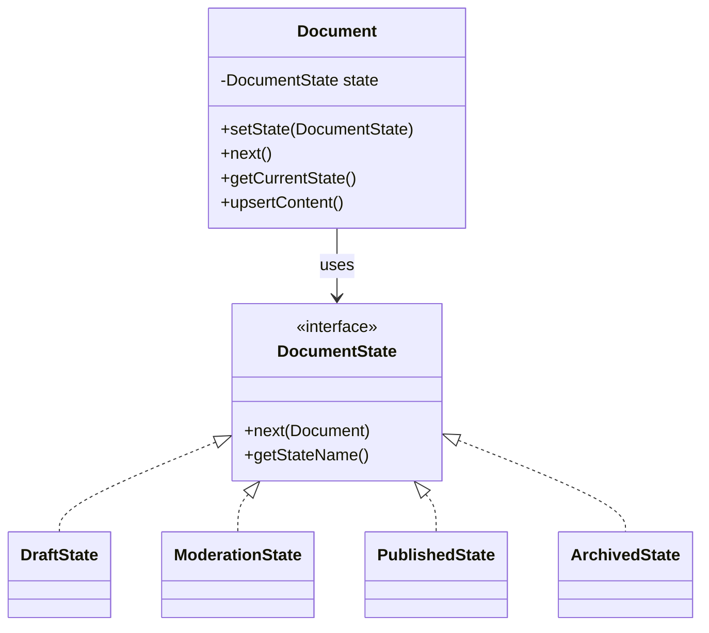
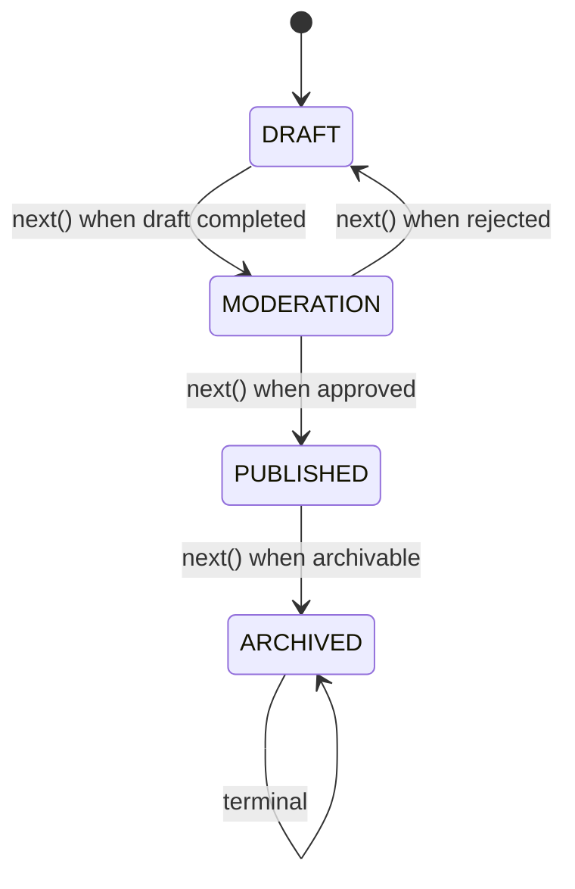

# Document Workflow — State Pattern Case Study

This case study demonstrates the State pattern by modeling a document lifecycle with distinct states.

## 🎯 Problem
A document progresses through drafting, moderation, publishing, and archiving. Behavior should vary based on the current state and transitions must be explicit and maintainable.

## ✅ Solution (State Pattern)
Each state is modeled as a class implementing a common interface. The `Document` delegates behavior to its current state, which decides the next transition.

## 🏗️ Structure
```
Document (Context)
├── DocumentState (State Interface)
├── DraftState
├── ModerationState
├── PublishedState
└── ArchivedState
```

## 📊 UML Diagram


## 🔄 State Transitions


## 🚀 Running the Demo
```bash
javac -d . caseStudies/DocumentWorkflow/*.java
java -cp . caseStudies.DocumentWorkflow.DocumentWorkflowMain
```

### Expected Output (sample)
```
Initial State: DRAFT
📄 Currently in Draft State...
Draft completed. Moving to Moderation...
State: MODERATION
👀 Document is under moderation...
Document approved ✅. Moving to Published state...
State: PUBLISHED
✅ Document is published!
📜 Content: This is the final version of the document.
Archiving document...
State: ARCHIVED
📦 Document is archived. No further actions possible.
Final State: ARCHIVED
```

## 🧩 Files
- Document.java — Context class
- DocumentState.java — State interface
- DraftState.java, ModerationState.java, PublishedState.java, ArchivedState.java — Concrete states
- DocumentStateEnum.java — Enum of state names
- DocumentWorkflowMain.java — Entry point

## 🎯 Key Takeaways
- Clean state-driven workflow for content lifecycle
- Eliminates conditional complexity
- Easy to extend with new states/transitions


