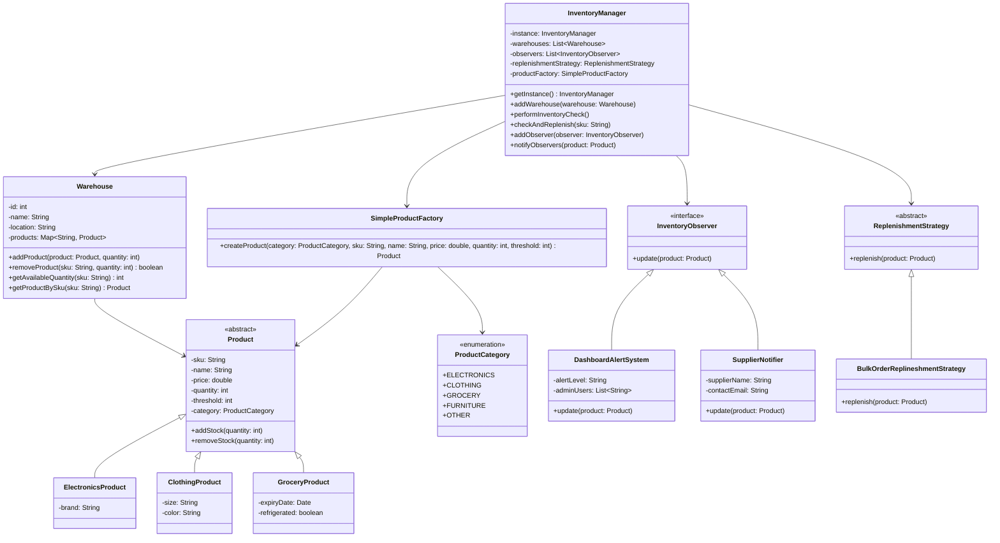

# Inventory Management System Case Study

A comprehensive inventory management system showcasing Observer pattern for notifications, Strategy pattern for replenishment, Factory pattern for product creation, and Singleton for centralized management.

## Problem Statement (brief)
- Manage inventory across multiple warehouses with different product categories.
- Monitor stock levels and trigger alerts when inventory falls below thresholds.
- Automatically replenish stock using configurable strategies.
- Notify stakeholders (admins, suppliers) about low inventory situations.
- Support different product types with category-specific attributes.
- **NEW**: Provide global inventory visibility and transfer operations between warehouses.

## Entities (detailed)
- InventoryManager (Singleton)
  - Purpose: Central orchestrator managing warehouses, observers, and replenishment strategies.
  - Data: `List<Warehouse> warehouses`, `List<InventoryObserver> observers`, `ReplenishmentStrategy strategy`, `SimpleProductFactory factory`.
  - Key ops: `performInventoryCheck()`, `checkAndReplenish(sku)`, `addObserver()`, `notifyObservers()`.
  - **NEW**: `getTotalQuantityAcrossWarehouses(sku)`, `transferProduct(sku, qty, from, to)`, `getWarehousesWithProduct(sku)`.
  - Notes: Singleton ensures single point of control; delegates to warehouses and strategies; provides global inventory view.

- Warehouse
  - Purpose: Physical storage location managing product inventory.
  - Data: `int id`, `String name`, `String location`, `Map<String, Product> products`.
  - Key ops: `addProduct()`, `removeProduct()`, `getAvailableQuantity()`, `getProductBySku()`.
  - **NEW**: `getName()`, `getId()`, `getLocation()` for transfer operations.
  - Notes: Handles stock operations with validation; removes products when quantity reaches zero; maintains independent inventory.

- Product hierarchy
  - Purpose: Domain model for different product categories with specific attributes.
  - Types: Abstract `Product` with concrete `ElectronicsProduct`, `ClothingProduct`, `GroceryProduct`.
  - Data: `sku`, `name`, `price`, `quantity`, `threshold`, `category`.
  - Category-specific: Electronics (brand), Clothing (size, color), Grocery (expiry, refrigerated).

- ProductCategory (Enum)
  - Purpose: Categorize products for factory creation and business rules.
  - Values: `ELECTRONICS`, `CLOTHING`, `GROCERY`, `FURNITURE`, `OTHER`.

- SimpleProductFactory (Factory)
  - Purpose: Create products based on category without exposing concrete classes.
  - API: `createProduct(category, sku, name, price, quantity, threshold)`.
  - Notes: Centralizes product creation logic; easily extensible for new categories.

- InventoryObserver (Observer Pattern)
  - Purpose: Interface for components interested in inventory changes.
  - Implementations: `DashboardAlertSystem`, `SupplierNotifier`.
  - API: `update(Product product)`.

- DashboardAlertSystem
  - Purpose: Notifies administrators about low inventory with severity levels.
  - Logic: Critical (≤25% of threshold), Warning (≤50% of threshold).
  - Data: `alertLevel`, `List<String> adminUsers`.

- SupplierNotifier
  - Purpose: Automatically notifies suppliers when stock is low.
  - Data: `supplierName`, `contactEmail`.

- ReplenishmentStrategy (Strategy Pattern)
  - Purpose: Encapsulate different stock replenishment algorithms.
  - Current impl: `BulkOrderReplineshmentStrategy` (orders 3x threshold).
  - Notes: Pluggable strategies for different business rules (JIT, bulk, seasonal).

- InventoryOperation (Enum)
  - Purpose: Track types of inventory operations for audit/logging.
  - Values: `ADD`, `REMOVE`, `TRANSFER`, `ADJUST`.

## Design Patterns Used
- Singleton
  - Where: `InventoryManager`.
  - Why: Single point of control for system-wide operations; prevents multiple managers.

- Observer
  - Where: `InventoryObserver` with `DashboardAlertSystem` and `SupplierNotifier`.
  - Why: Decouple inventory monitoring from notification logic; multiple stakeholders can subscribe.

- Strategy
  - Where: `ReplenishmentStrategy` with `BulkOrderReplineshmentStrategy`.
  - Why: Pluggable replenishment algorithms; easy to change business rules without code changes.

- Factory Method (Simple Factory)
  - Where: `SimpleProductFactory`.
  - Why: Centralize product creation; hide concrete class selection from clients.

- Template Method (implicit)
  - Where: Product hierarchy with common operations (`addStock`, `removeStock`).
  - Why: Consistent behavior across product types while allowing category-specific attributes.

## Class Diagram


## Sequence: Low Inventory Detection & Replenishment


## Run
From repository root:
```bash
javac -d . caseStudies/InventoryManagementSystem/**/**/*.java
java -cp . caseStudies.InventoryManagementSystem.InventoryManagementMain
```

## Inventory Distribution & Transfer Flow

### Distributed Inventory Model
Each warehouse maintains **independent inventory**. The same product (SKU) can exist in multiple warehouses with different quantities:

```
Warehouse NYC: Laptop (LAP001) = 50 units
Warehouse LA:  Laptop (LAP001) = 20 units
Total Global:  Laptop (LAP001) = 70 units
```

### Transfer Operations
Products can be moved between warehouses using the `transferProduct()` method:

```java
// Transfer 15 laptops from LA to NYC
manager.transferProduct("LAP001", 15, warehouseLA, warehouseNYC);
```

**Transfer Process:**
1. Validate source warehouse has sufficient stock
2. Remove quantity from source warehouse
3. Add quantity to destination warehouse
4. Maintain product details (price, threshold, etc.)

### Global Inventory Queries
- `getTotalQuantityAcrossWarehouses(sku)`: Sums quantity across all warehouses
- `getWarehousesWithProduct(sku)`: Returns list of warehouses containing the product

## Observer Pattern Flow

### How Observer Works
The Observer pattern enables **decoupled notifications** when inventory levels change:

1. **Registration**: Observers subscribe to InventoryManager
   ```java
   manager.addObserver(dashboardAlert);
   manager.addObserver(supplierNotifier);
   ```

2. **Trigger**: When inventory check detects low stock
   ```java
   if (product.getQuantity() < product.getThreshold()) {
       notifyObservers(product); // Triggers all observers
   }
   ```

3. **Notification**: Each observer receives the product and acts accordingly
   - **DashboardAlertSystem**: Sends email alerts to administrators
   - **SupplierNotifier**: Notifies suppliers for restocking

### Observer Benefits
- **Loose Coupling**: InventoryManager doesn't know about specific notification methods
- **Extensibility**: Easy to add new observers (SMS, Slack, etc.)
- **Single Responsibility**: Each observer handles one type of notification

## Complete System Flow

### 1. Initialization
```java
InventoryManager manager = InventoryManager.getInstance();
Warehouse warehouse1 = new Warehouse(1, "NYC", "New York");
manager.addWarehouse(warehouse1);
```

### 2. Product Creation & Distribution
```java
Product laptop = factory.createProduct(ELECTRONICS, "LAP001", "Gaming Laptop", 1299.99, 50, 10);
warehouse1.addProduct(laptop, 50); // Add 50 laptops to NYC warehouse
```

### 3. Inventory Monitoring
```java
manager.performInventoryCheck(); // Scans all warehouses for low stock
```

### 4. Low Stock Detection & Response
When stock falls below threshold:
1. **Observer Notification**: All registered observers are notified
2. **Replenishment**: Strategy pattern applies replenishment logic
3. **Stock Update**: Product quantity is increased

### 5. Transfer Operations
```java
manager.transferProduct("LAP001", 15, warehouseLA, warehouseNYC);
// Moves 15 laptops from LA to NYC warehouse
```

## Notes / Extensions
- ✅ **COMPLETED**: Transfer operations between warehouses
- Implement different replenishment strategies (JIT, seasonal, demand-based)
- Add product expiration handling for grocery items
- Integrate with external supplier APIs for automated ordering
- Add inventory forecasting based on historical data
- Implement barcode/QR code scanning for stock operations
- Add inventory audit trails and transaction logging
