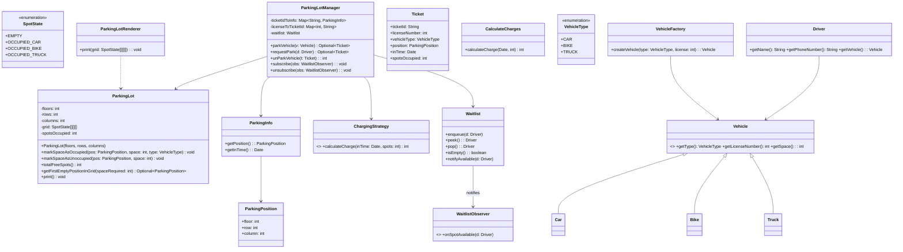

# Parking Lot Case Study

Comprehensive parking lot simulation with tickets, waitlist notifications (Observer), pluggable pricing strategy, and a typed grid.

## Problem Statement (brief)
- Support multiple vehicle types with different contiguous spot requirements.
- Multi-floor grid with rows and columns; contiguous allocation per row.
- Park → issue ticket; Unpark → compute charges; render current state.
- If full, add driver+vehicle to a waitlist and notify when a spot becomes available.

## Entities (brief)
- ParkingLot: Maintains a 3D grid of `SpotState`; finds first fit; marks occupy/release.
- ParkingPosition: Record for (floor,row,column) start of allocation.
- SpotState: EMPTY, OCCUPIED_CAR, OCCUPIED_BIKE, OCCUPIED_TRUCK.
- Vehicle: Abstract; `Car`, `Bike`, `Truck`; `VehicleType` encodes `spaceRequired`.
- Ticket: Immutable record of a parking session (id, type, position, inTime, spots).
- ParkingInfo: Immutable internal store of position and in-time.
- ChargingStrategy: Strategy interface; `CalculateCharges` is a flat-rate per spot per hour.
- ParkingLotRenderer: Renders the grid (separation of concerns).
- Driver: Name, phone, and associated Vehicle (1:1 for now).
- Waitlist/Observer: FIFO of Drivers; `WaitlistObserver` gets notified when a spot is served.

## Design Overview
- API: `parkVehicle(Vehicle) -> Optional<Ticket>`; `unParkVehicle(Ticket) -> int`.
- If `parkVehicle` fails via `requestPark(Driver)`, the driver is enqueued.
- On `unParkVehicle`, manager attempts to auto-serve the next driver in waitlist; observers get notified with that driver.
- Pricing via `ChargingStrategy`; easily switchable.
- Rendering moved out of the core model.

## Class Diagram


## Sequence: Waitlist Serve & Notify


## Run
From repository root:
```bash
javac -d . caseStudies/ParkingLot/**/**/*.java
java -cp . caseStudies.ParkingLot.Main
```

## Notes
- Contiguity: allocation requires contiguous cells in a row; manager scans floors/rows.
- Pricing: ceil(hours) × rate × spots; strategy interface allows swapping rules.
- Tickets: un-park by ticket; state is tracked immutably.
- Observer: drivers failing to park are queued and notified when auto-served.


