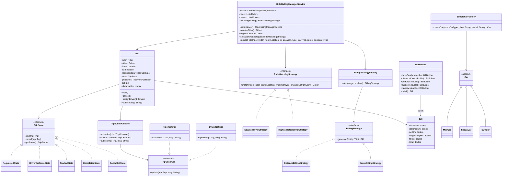
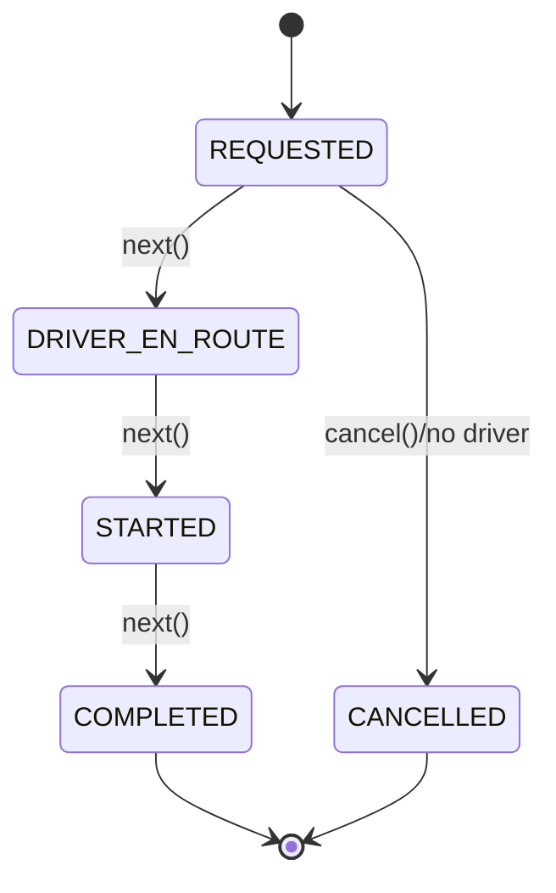
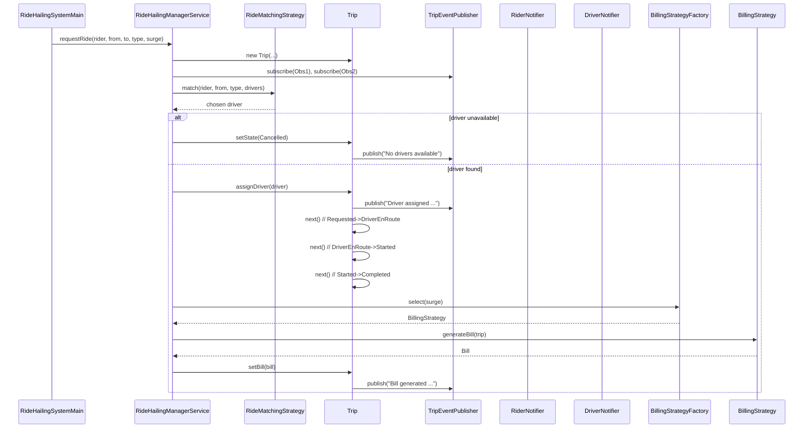

# Ride Hailing System Case Study

A modular ride-hailing simulation demonstrating State, Strategy, Factory, Observer, Singleton, and Builder patterns.

## Problem Statement (brief)
- Riders request trips specifying pickup, drop, and car type.
- System matches a suitable driver based on configurable strategy (nearest/highest-rated).
- Trip advances through states from request to completion.
- Fare is calculated via configurable billing strategies (with/without surge).
- Observers receive updates on trip lifecycle events.

## Entities (detailed)
- RideHailingManagerService (Singleton)
  - Purpose: Orchestrates end-to-end trip flow and resource management.
  - Data: `List<Rider>`, `List<Driver>`, `RideMatchingStrategy strategy`.
  - Key ops: `registerRider()`, `registerDriver()`, `setMatchingStrategy()`, `requestRide()`.
  - Notes: Singleton (`getInstance()`) centralizes coordination.

- Trip (State + Observer)
  - Purpose: Represents a single ride with lifecycle, participants, and billing.
  - Data: `Rider`, `Driver`, `Location from/to`, `CarType`, `TripState state`, `TripEventPublisher publisher`, `Bill`, timestamps, `distanceKm`.
  - Key ops: `next()`, `cancel()`, `assignDriver()`, `publish()`.
  - Notes: Publishes human-readable messages to observers on state changes.

- TripState hierarchy (State Pattern)
  - `RequestedState` → `DriverEnRouteState` → `StartedState` → `CompletedState`, with `CancelledState` path.
  - Interface: `TripState` with `next(Trip)`, `cancel(Trip)`, `getStatus()`.

- Matching (Strategy Pattern)
  - `RideMatchingStrategy`: `NearestDriverStrategy`, `HighestRatedDriverStrategy`.
  - Chooses a driver among available drivers given rider location and requested car type.

- Billing (Strategy + Factory)
  - `BillingStrategy`: `DistanceBillingStrategy`, `SurgeBillingStrategy`.
  - Selected via `BillingStrategyFactory.select(surgeOn)`.
  - Uses `Bill.Builder` to compose final bill amounts.

- Cars (Factory)
  - `SimpleCarFactory` creates `MiniCar`, `SedanCar`, `SUVCar` via `CarType`.

- Users
  - `Rider`, `Driver` (availability, rating, `Location`).

- Utils
  - `Location` with `distanceKm(a, b)` used by matching and billing.

- Trip Observer System (Observer Pattern)
  - `TripEventPublisher` with `subscribe()`, `unsubscribe()`, `publish(trip, msg)`.
  - Observers: `RiderNotifier`, `DriverNotifier` implementing `TripObserver.update(trip, msg)`.

## Design Patterns Used
- Singleton: `RideHailingManagerService` ensures a single orchestrator.
- State: `TripState` hierarchy governs trip lifecycle.
- Strategy: `RideMatchingStrategy` and `BillingStrategy` are pluggable.
- Factory: `SimpleCarFactory` (cars), `BillingStrategyFactory` (billing strategies).
- Observer: `TripEventPublisher` with `TripObserver` subscribers.
- Builder: `Bill.Builder` constructs immutable `Bill` with derived totals.

## Class Diagram


## State Diagram (Trip Lifecycle)


## Enums
- CarType
  - Values: `MINI`, `SEDAN`, `SUV`
  - Fields: `perKm`, `baseFare`
- TripStatus
  - Values: `REQUESTED`, `DRIVER_EN_ROUTE`, `STARTED`, `COMPLETED`, `CANCELLED`, `FAILED`


## Sequence: Request to Completion


## Run
From repository root:
```bash
javac -d . caseStudies/RideHailingSystem/**/**/*.java
java -cp . caseStudies.RideHailingSystem.RideHailingSystemMain
```

## Notes / Extensions
- Add geo-indexing for faster nearest-driver lookups.
- Add cancellation flows with penalties.
- Replace String messages with typed events.
- Add tests for matching/billing strategies and state transitions.
- Add persistence and real-time websockets for observer updates.


