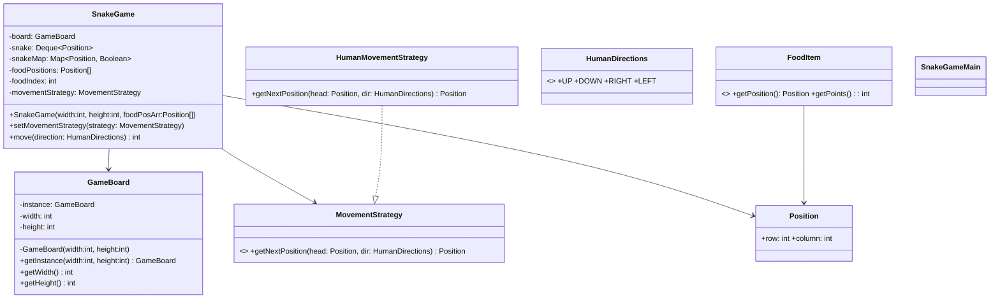
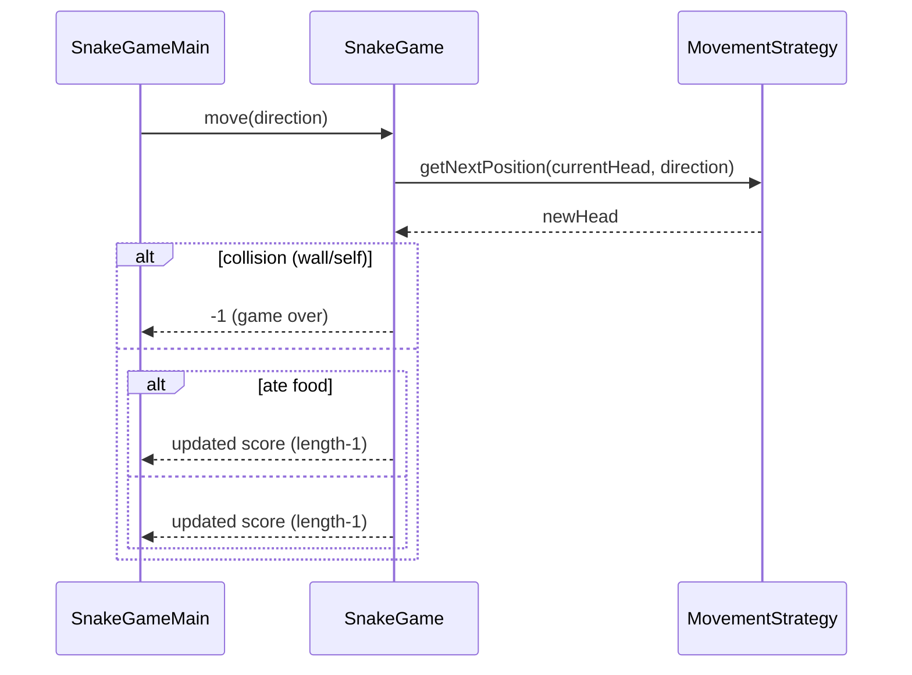

# Snake and Food Case Study

A console Snake game showcasing clean modeling, Strategy pattern for movement, a Singleton game board, and immutable value objects.

## Problem Statement (brief)
- Control a snake on a 2D grid; eat food to grow and increase score.
- The snake dies on wall collision or when it bites itself.
- Movement input comes from the user (W/A/S/D) mapped to directions.
- Food appears in predefined positions for determinism in this version.

## Entities (detailed)
- GameBoard (Singleton)
  - Purpose: Global board configuration (width, height); single instance across the game.
  - API: `getInstance(width, height)`, `getWidth()`, `getHeight()`.
  - Notes: Lazily initialized; subsequent calls reuse the first created dimensions.

- Position (Value Object)
  - Purpose: Immutable cell coordinate on the board.
  - API/Data: Java `record Position(int row, int column)`.

- SnakeGame (Domain/Orchestrator)
  - Purpose: Maintains snake body, detects collisions, handles food consumption and scoring.
  - Data: `Deque<Position> snake`, `Map<Position,Boolean> snakeMap`, `Position[] foodPositions`, `int foodIndex`, `MovementStrategy movementStrategy`, `GameBoard board`.
  - Key ops: `move(HumanDirections)` → returns score (−1 on game over).
  - Logic:
    - Compute next head via strategy.
    - Check wall/self collision; return −1 if true.
    - If next cell has food: grow (do not remove tail); else move (remove tail).
    - Update head and membership map; score = snake length − 1.

- MovementStrategy (Strategy) and HumanMovementStrategy
  - Purpose: Encapsulate how the next head position is computed from a direction.
  - API: `getNextPosition(Position currentHead, HumanDirections direction)`.
  - Current impl: `HumanMovementStrategy` adds deltas from `HumanDirections` to current head.

- HumanDirections (Enum)
  - Purpose: Map user input to row/column deltas.
  - Values: `UP(0,-1)`, `DOWN(0,1)`, `RIGHT(1,0)`, `LEFT(-1,0)`.

- FoodItem (Abstract)
  - Purpose: Base for future extensible food items with different point values/effects.
  - Data/API: `position`, `points`, `getPosition()`, `getPoints()`.

- SnakeGameMain (Driver)
  - Purpose: Console loop: prints help, reads input, calls `move`, prints score / game over.
  - Notes: Converts W/A/S/D to `HumanDirections`; uses predefined food positions.

## Design Patterns Used
- Strategy
  - Where: `MovementStrategy` with `HumanMovementStrategy`.
  - Why: Pluggable movement logic (future: AI/autopilot, wrap-around, portals).

- Singleton
  - Where: `GameBoard`.
  - Why: Single source of truth for board size; avoid passing dimensions everywhere.

- Value Object/Record
  - Where: `Position`.
  - Why: Immutable coordinates; simpler equality/collection semantics.

## Class Diagram


## Sequence: Move Tick


## Run
From repository root:
```bash
javac -d . caseStudies/SnakeAndFood/**/**/*.java
java -cp . caseStudies.SnakeAndFood.SnakeGameMain
```

## Notes / Extensions
- Replace predefined food with random spawns and a `FoodSpawner` strategy.
- Add `Renderer` to draw the grid and snake in console or GUI.
- Add alternate movement strategies (AI, wrap-around, accelerate).
- Support obstacles and special food types via concrete `FoodItem`s.

