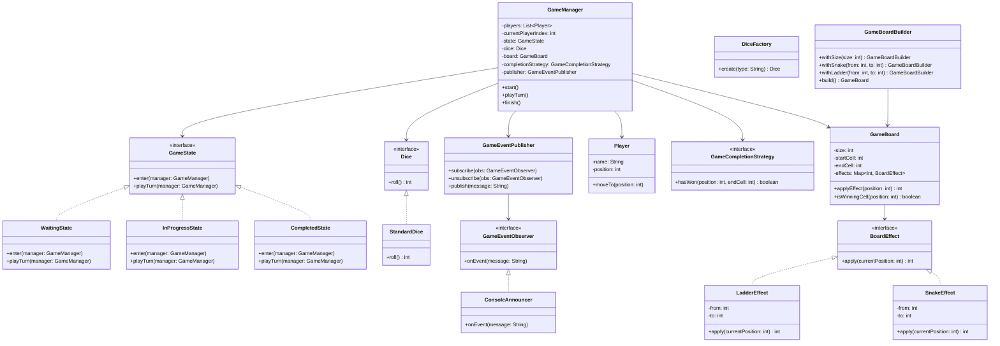
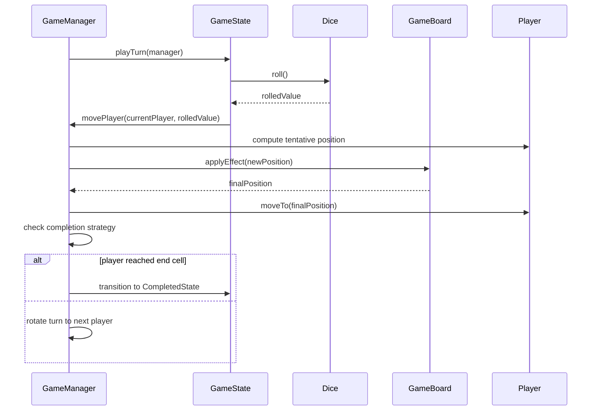

# Snake and Ladder Case Study

A clean, extensible Snake & Ladder implementation showcasing State, Strategy, Factory, Builder, Observer, and Singleton patterns with a well-modeled domain.

## Problem Statement (brief)
- Simulate a game of Snake and Ladder between multiple players.
- Pluggable dice strategies (fair/biased/multiple dice).
- Flexible board creation with snakes, ladders and optional effects.
- Proper game states: waiting, in-progress, completed.
- Deterministic rules: exact roll to win (configurable).

## Entities (detailed)
- GameManager
  - Purpose: Orchestrates the entire game loop and state transitions.
  - Data: `List<Player> players`, `int currentPlayerIndex`, `GameState state`, `Dice dice`, `GameBoard board`, `GameCompletionStrategy completionStrategy`.
  - Key ops: `start()`, `playTurn()`, `movePlayer(Player, int)`, `applyEffects(int)`, `finish()`.
  - Notes: Holds the single source of truth for game progress. Implemented as a **Singleton** (`private static final GameManager INSTANCE` + `getInstance()`), ensuring a single coordinator per game run. Also owns a `GameEventPublisher` to broadcast turn events to observers.

- GameState (interface)
  - Purpose: Encapsulate behavior per lifecycle phase.
  - Implementations: `WaitingState`, `InProgressState`, `CompletedState`.
  - Key ops: `enter(GameManager)`, `playTurn(GameManager)`.

- Dice (Strategy)
  - Purpose: Roll strategy (fair, biased, n-dice, mocked for tests).
  - Implementations: `StandardDice` (1..6).
  - Key ops: `roll() int`.

- DiceFactory (Factory)
  - Purpose: Create dice by type/config.
  - Key ops: `create(String type)`.

- GameBoard
  - Purpose: Board representation; knows size and effects for cells.
  - Data: `int size`, `Map<Integer, BoardEffect> effects`, `int startCell`, `int endCell`.
  - Key ops: `applyEffect(int position) int`, `isWinningCell(int position) boolean`.

- GameBoardBuilder (Builder)
  - Purpose: Fluent construction of boards with snakes and ladders.
  - Key ops: `withSize(int)`, `withSnake(int from, int to)`, `withLadder(int from, int to)`, `build()`.

- BoardEffect (interface)
  - Purpose: Effect applied when a player lands on a cell.
  - Implementations: `SnakeEffect(from -> to)`, `LadderEffect(from -> to)`.
  - Key ops: `apply(int currentPosition) int`.

- GameEvent (Observer system)
  - Components:
    - `GameEventObserver` (interface): `onEvent(String message)`
    - `GameEventPublisher`: `subscribe()`, `unsubscribe()`, `publish(message)`
    - `ConsoleAnnouncer` (observer): prints updates to console
  - Purpose: Decouple game progress announcements from the game loop. Observers can be added (e.g., UI, logger, remote client) without changing game logic.

- Player
  - Purpose: Represents a participant in the game.
  - Data: `String name`, `int position`.
  - Key ops: `moveTo(int)`, `getPosition()`.

## Design Patterns Used
- State
  - Where: `GameState` with `WaitingState`, `InProgressState`, `CompletedState`.
  - Why: Cleanly separates behavior by game phase and avoids conditionals.

- Strategy
  - Where: `Dice` (e.g., `StandardDice`).
  - Why: Switch dice behavior without changing game loop.

- Factory
  - Where: `DiceFactory`.
  - Why: Centralize dice creation and encapsulate variants.

- Builder
  - Where: `GameBoardBuilder`.
  - Why: Fluent, readable setup for complex boards.

- Observer
  - Where: `GameEventPublisher` with `GameEventObserver` and `ConsoleAnnouncer`.
  - Why: Broadcast game events (turn start, dice roll, moves, wins) to multiple listeners without coupling the core loop to I/O or UI.

- Singleton
  - Where: `GameManager`.
  - Why: Ensure a single authoritative game coordinator; simplifies access and avoids inconsistent state across duplicates.

## Class Diagram


## Sequence: A Player Turn


## Run
From repository root:
```bash
javac -d . caseStudies/SnakeAndLadder/**/**/*.java
java -cp . caseStudies.SnakeAndLadder.SnakeAndLadderMain
```

## Notes / Extensions
- Add more dice strategies (advantage/handicap, two dice total, etc.).
- Add event system to publish turn events (UI/logs/bots).
- Add persistence for match replay.
- Add custom board scripts (JSON/YAML → builder).
- House rules: overshoot handling, extra turn on six, etc.


