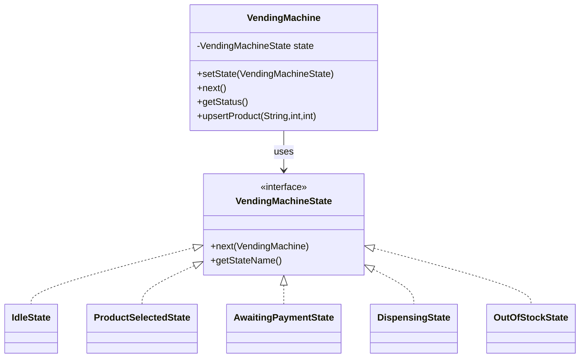
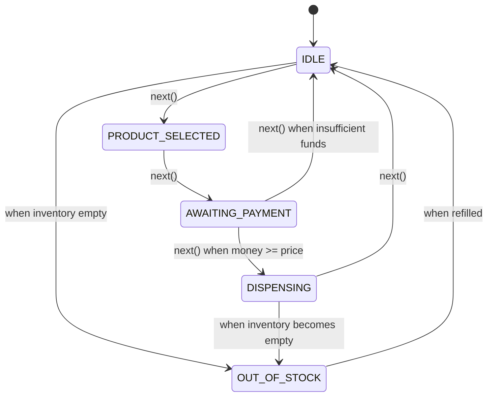

# Vending Machine — State Pattern Case Study

This case study demonstrates the State pattern by modeling a Vending Machine with distinct operational states.

## 🎯 Problem
A vending machine needs to handle product selection, payment, dispensing, and stock management. Behavior varies depending on the machine's current state.

## ✅ Solution (State Pattern)
We model each state as a separate class implementing a common interface. The machine delegates behavior to its current state, which decides transitions.

## 🏗️ Structure
```
VendingMachine (Context)
├── VendingMachineState (State Interface)
├── IdleState
├── ProductSelectedState
├── AwaitingPaymentState
├── DispensingState
└── OutOfStockState
```

## 📊 UML Diagram


## 🔄 State Transitions


## 🚀 Running the Demo
```bash
javac -d . caseStudies/VendingMachine/*.java
java -cp . caseStudies.VendingMachine.VendingMachineMain
```

### Expected Output (sample)
```
Initial State: IDLE
Currently in Idle State...
User inserted money. Moving to PRODUCT_SELECTED state...
Product selection in progress...
Product selected: Coke. Awaiting payment...
Awaiting payment...
Payment accepted. Dispensing product...
Dispensing product: Coke
Returning to IDLE state.
```

## 🧩 Files
- VendingMachine.java — Context class
- VendingMachineState.java — State interface
- IdleState.java, ProductSelectedState.java, AwaitingPaymentState.java, DispensingState.java, OutOfStockState.java — Concrete states
- VendingMachineStatesEnum.java — Enum of state names
- Product.java — Simple product record
- VendingMachineMain.java — Entry point

## 🎯 Key Takeaways
- Cleanly models finite state machines
- Eliminates conditional complexity
- Easy to extend with new states or transitions
