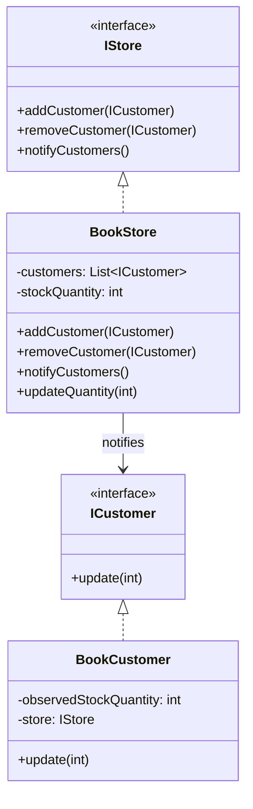
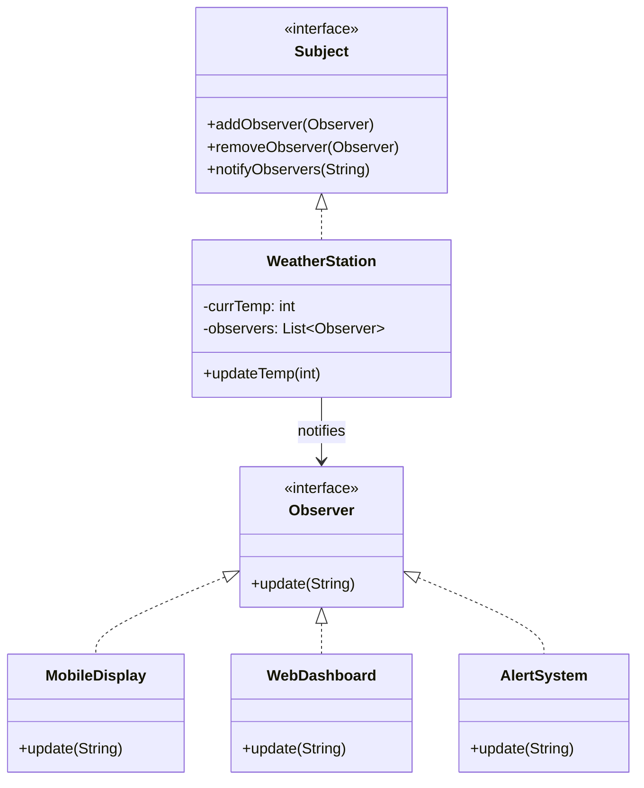

# Observer Pattern

## Overview
The Observer pattern defines a one-to-many dependency between objects so that when one object changes state, all its dependents are notified and updated automatically.

## Examples in this folder
- `bookstore/` — Stock notifications for a bookstore (subject: `BookStore`, observers: `BookCustomer`)
- `weather/` — Temperature updates broadcast (subject: `WeatherStation`, observers: `MobileDisplay`, `WebDashboard`, `AlertSystem`)

## UML (BookStore)


## UML (Weather)


## Run
```bash
# BookStore
javac -d . designPatterns/behavioural/observer/bookstore/*.java
java -cp . designPatterns.behavioural.observer.bookstore.Main

# Weather
javac -d . designPatterns/behavioural/observer/weather/*.java
java -cp . designPatterns.behavioural.observer.weather.Main
```
