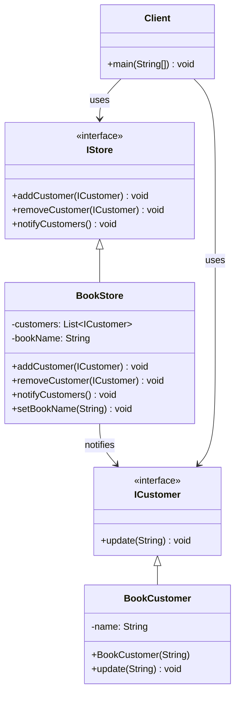

# Observer Pattern

## Overview
The Observer pattern defines a one-to-many dependency between objects so that when one object changes state, all its dependents are notified and updated automatically. This pattern is fundamental for implementing event-driven architectures.

## Problem
- Need to notify multiple objects about state changes
- Tight coupling between subject and observers
- Want to add/remove observers dynamically
- Need to maintain consistency between related objects

## Solution
- Define subject-observer relationship
- Subject notifies all observers of changes
- Observers register/unregister dynamically
- Loose coupling between subject and observers

## UML Diagram



## Code Structure

### Files
- `IStore.java` - Interface for observable stores
- `ICustomer.java` - Interface for observer customers
- `BookStore.java` - Concrete subject that notifies observers
- `BookCustomer.java` - Concrete observer that receives notifications
- `Main.java` - Demonstration of observer pattern

### Key Components

#### IStore Interface
```java
public interface IStore {
    void addCustomer(ICustomer customer);
    void removeCustomer(ICustomer customer);
    void notifyCustomers();
}
```

#### ICustomer Interface
```java
public interface ICustomer {
    void update(String message);
}
```

#### BookStore Implementation
```java
public class BookStore implements IStore {
    private List<ICustomer> customers = new ArrayList<>();
    private String bookName;

    @Override
    public void addCustomer(ICustomer customer) {
        customers.add(customer);
    }

    @Override
    public void removeCustomer(ICustomer customer) {
        customers.remove(customer);
    }

    @Override
    public void notifyCustomers() {
        for (ICustomer customer : customers) {
            customer.update("New book available: " + bookName);
        }
    }

    public void setBookName(String bookName) {
        this.bookName = bookName;
        notifyCustomers();
    }
}
```

#### BookCustomer Implementation
```java
public class BookCustomer implements ICustomer {
    private String name;

    public BookCustomer(String name) {
        this.name = name;
    }

    @Override
    public void update(String message) {
        System.out.println(name + " received: " + message);
    }
}
```

## Usage Example

```bash
# Compile and run
javac -d . designPatterns/behavioural/observer/*.java
java -cp . designPatterns.behavioural.observer.Main
```

**Expected Output:**
```
Alice received: New book available: Design Patterns
Bob received: New book available: Design Patterns
Charlie received: New book available: Design Patterns
Alice received: New book available: Clean Code
Bob received: New book available: Clean Code
```

## Benefits
- **Loose Coupling**: Subject and observers are loosely coupled
- **Dynamic Relationships**: Add/remove observers at runtime
- **Broadcast Communication**: One-to-many communication
- **Open/Closed Principle**: Easy to add new observers
- **Event-Driven Architecture**: Supports event-driven programming

## Use Cases
- Model-View architectures (MVC, MVP, MVVM)
- Event handling systems
- Notification systems
- Real-time data updates
- GUI frameworks

## Variations
- **Push Model**: Subject sends detailed data to observers
- **Pull Model**: Observers request data from subject
- **Event-Driven**: Use events instead of direct method calls
- **Reactive Programming**: Modern reactive streams

## Anti-Patterns to Avoid
- **Memory Leaks**: Don't forget to remove observers
- **Performance Issues**: Too many observers can slow down notifications
- **Circular Dependencies**: Avoid observers that depend on each other
- **Tight Coupling**: Don't make observers depend on concrete subjects

## Related Patterns
- **Mediator**: Coordinates communication between objects
- **Command**: Encapsulates requests as objects
- **Chain of Responsibility**: Passes requests along chain
- **Publish-Subscribe**: Similar to observer with message brokers

## When to Use
- Need to notify multiple objects about changes
- Want to decouple subject from observers
- Need to add/remove observers dynamically
- Implementing event-driven architecture

## When NOT to Use
- Simple one-to-one communication
- Performance is critical
- Observers are always the same
- Over-engineering simple problems

## Implementation Considerations

### Design Principles
- **Single Responsibility**: Each observer has one responsibility
- **Open/Closed**: Open for extension, closed for modification
- **Loose Coupling**: Minimize dependencies between objects
- **Interface Segregation**: Keep interfaces focused

### Best Practices
- Use interfaces for subject and observer
- Handle exceptions in observers
- Consider thread safety
- Document observer behavior
- Use weak references to prevent memory leaks

### Common Pitfalls
- **Memory Leaks**: Forgetting to remove observers
- **Performance**: Too many observers
- **Circular Dependencies**: Observers depending on each other
- **Exception Handling**: One observer's exception shouldn't break others
