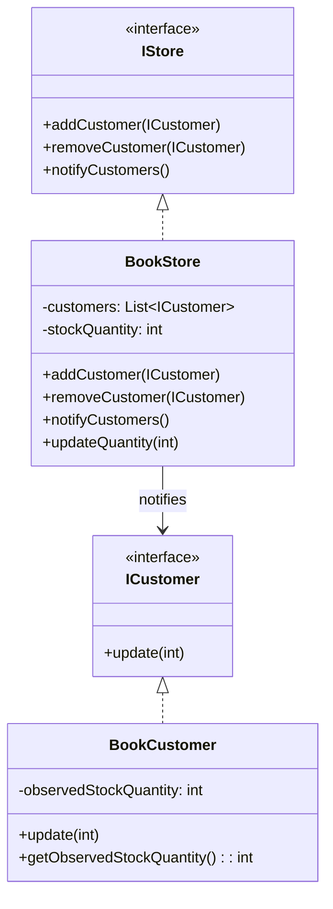

# Observer — BookStore Example

Stock notifications when a book's quantity changes.

## UML


## Entities
- `IStore`: Subject contract for customer registration and notifications
- `ICustomer`: Observer contract receiving stock updates
- `BookStore`: Concrete subject maintaining stock and notifying customers
- `BookCustomer`: Concrete observer reacting to stock changes

## Run
```bash
javac -d . designPatterns/behavioural/observer/bookstore/*.java
java -cp . designPatterns.behavioural.observer.bookstore.Main
```
