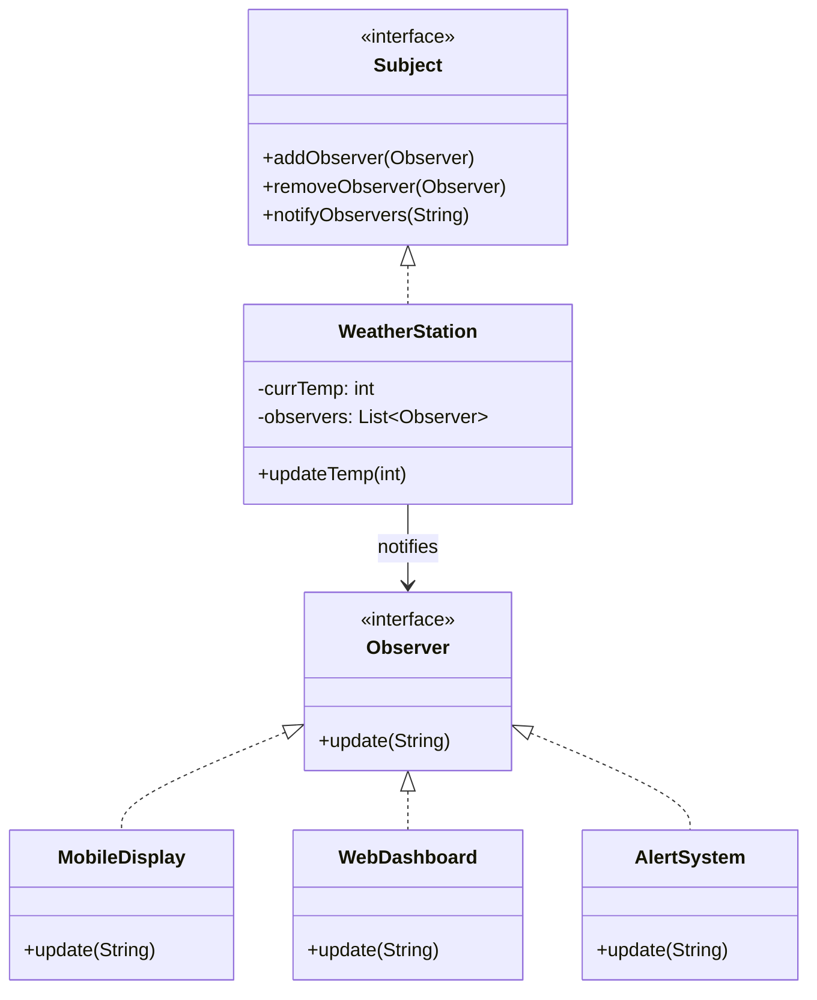

# Observer — Weather Example

Broadcast temperature changes to multiple displays.

## UML


## Entities
- `Subject`: Contract for registering/removing observers and notifying them
- `Observer`: Receives updates from the subject
- `WeatherStation`: Concrete subject managing temperature and notifications
- `MobileDisplay`, `WebDashboard`, `AlertSystem`: Concrete observers

## Run
```bash
javac -d . designPatterns/behavioural/observer/weather/*.java
java -cp . designPatterns.behavioural.observer.weather.Main
```
