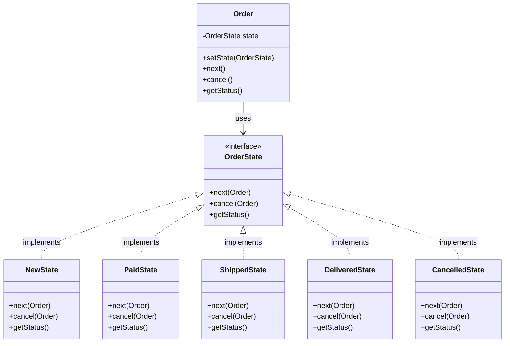
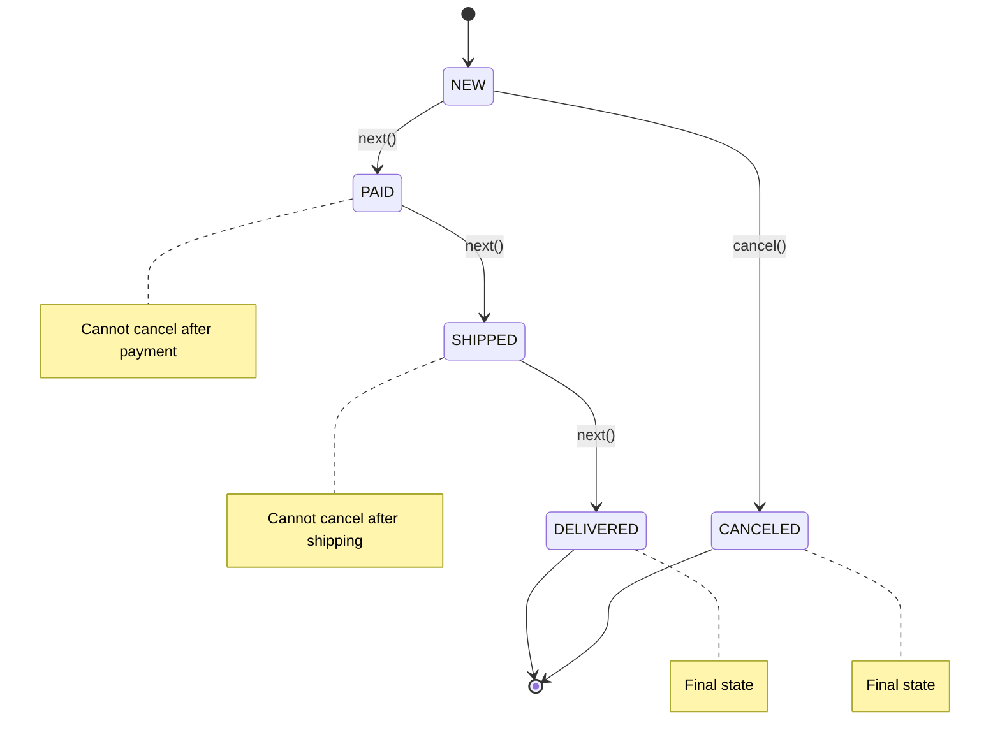

# State Pattern

The **State Pattern** allows an object to alter its behavior when its internal state changes. The object will appear to change its class, providing a clean way to represent state machines and complex conditional logic.

## 🎯 Problem

Consider an e-commerce order system where an order can be in different states: NEW, PAID, SHIPPED, DELIVERED, or CANCELED. Each state has different behaviors:

- **NEW**: Can be paid or canceled
- **PAID**: Can be shipped, but cannot be canceled
- **SHIPPED**: Can be delivered, but cannot be canceled
- **DELIVERED**: Final state, no further actions
- **CANCELED**: Final state, no further actions

Without the State pattern, you'd have complex if-else chains or switch statements scattered throughout the code, making it hard to maintain and extend.

## ✅ Solution

The State pattern encapsulates state-specific behavior in separate classes and delegates state transitions to these classes. The context object maintains a reference to the current state and delegates operations to it.

## 🏗️ Structure

```
Order (Context)
├── OrderState (State Interface)
├── NewState (Concrete State)
├── PaidState (Concrete State)
├── ShippedState (Concrete State)
├── DeliveredState (Concrete State)
└── CancelledState (Concrete State)
```

## 📊 UML Diagram



## 🔄 State Transitions



## 💻 Implementation

### Core Components

1. **OrderState Interface**: Defines the contract for all states
2. **Order (Context)**: Maintains current state and delegates operations
3. **Concrete States**: Implement state-specific behavior

### Key Features

- **State Encapsulation**: Each state knows its own transitions
- **Clean Transitions**: States handle their own next/cancel logic
- **Extensibility**: Easy to add new states or modify existing ones
- **Single Responsibility**: Each state class has one clear purpose

## 🚀 Usage Example

```java
public class Main {
    public static void main(String[] args) {
        Order order = new Order();

        System.out.println(order.getStatus()); // NEW
        order.next(); // Paying
        System.out.println(order.getStatus()); // PAID
        order.next(); // Shipping
        System.out.println(order.getStatus()); // SHIPPED
        order.next(); // Delivering
        System.out.println(order.getStatus()); // DELIVERED

        order.cancel(); // Cannot cancel
    }
}
```

## 🎯 Benefits

- **Eliminates Conditional Logic**: No more complex if-else chains
- **Easy to Extend**: Add new states without modifying existing code
- **Clear State Management**: Each state is self-contained
- **Better Testability**: Each state can be tested independently
- **Follows Open/Closed Principle**: Open for extension, closed for modification

## 🔧 When to Use

- Object behavior depends on its state
- Operations have state-specific implementations
- State transitions are complex
- You want to avoid large conditional statements
- State-specific behavior needs to be encapsulated

## 🔄 Running the Example

```bash
# Compile
javac -d . designPatterns/behavioural/state/*.java

# Run
java -cp . designPatterns.behavioural.state.Main
```

**Expected Output:**
```
NEW
Order paid successfully.
PAID
Order shipped.
SHIPPED
Order delivered.
DELIVERED
Cannot cancel, order already delivered.
```

## 🎨 Variations

- **State with History**: Track state transition history
- **Hierarchical States**: Parent-child state relationships
- **Concurrent States**: Multiple active states simultaneously
- **State with Guards**: Conditional state transitions

---

*The State pattern is perfect for modeling complex workflows, game states, UI components, and any system where behavior changes based on internal state.*
