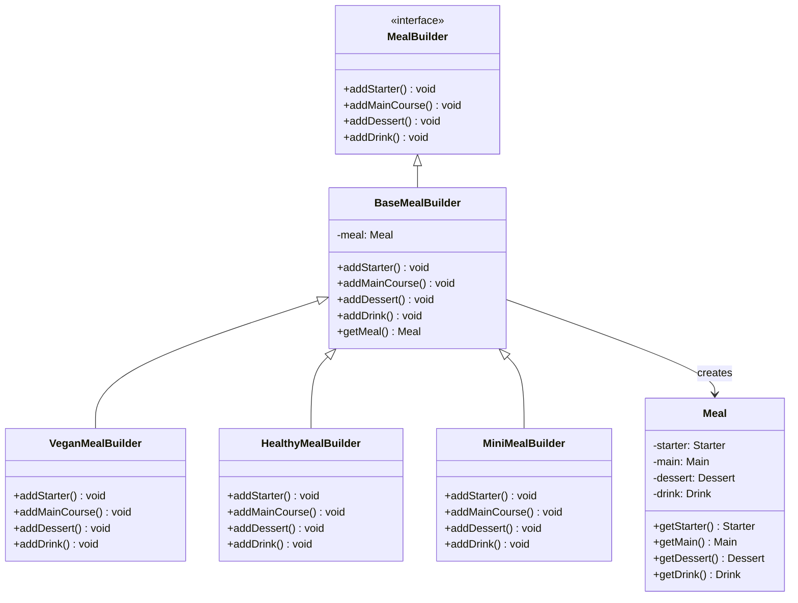

# Builder Pattern

## Overview
The Builder pattern constructs complex objects step by step. It allows you to produce different types and representations of an object using the same construction code. The pattern is particularly useful when an object has many optional parameters or when the construction process is complex.

## Problem
- Complex object construction with many parameters
- Multiple ways to construct the same object
- Constructor parameter lists becoming unwieldy
- Need for immutable objects with flexible construction

## Solution
- Separate object construction from representation
- Step-by-step construction process
- Fluent interface for readable code
- Director class to orchestrate construction

## UML Diagram (Classic Meal)



## Code Structure

### Files
- `Meal.java` - Product class with meal components
- `BaseMealBuilder.java` - Abstract builder with common functionality
- `VeganMealBuilder.java` - Concrete builder for vegan meals
- `HealthyMealBuilder.java` - Concrete builder for healthy meals
- `MiniMealBuilder.java` - Concrete builder for mini meals
- `Main.java` - Demonstration of builder pattern
- `enums/` - Enum definitions for meal components

### Key Components

#### Meal.java
```java
public class Meal {
    private Starter starter = null;
    private Main main = null;
    private Dessert dessert = null;
    private Drink drink = null;

    // Getters and setters for all components
}
```

#### BaseMealBuilder.java
```java
public abstract class BaseMealBuilder {
    protected Meal meal;

    public BaseMealBuilder() {
        this.meal = new Meal();
    }

    public abstract void addStarter();
    public abstract void addMainCourse();
    public abstract void addDessert();
    public abstract void addDrink();

    public Meal getMeal() {
        return this.meal;
    }
}
```

## Usage Examples

```bash
# Compile and run classic builder example (Meal)
javac -d . designPatterns/creational/builder/enums/*.java designPatterns/creational/builder/classic/*.java
java -cp . designPatterns.creational.builder.classic.Main

# Compile and run fluent builder example (Pizza)
javac -d . designPatterns/creational/builder/fluent/*.java
java -cp . designPatterns.creational.builder.fluent.Main

# Compile and run fluent builder + factory example (Pizza)
javac -d . designPatterns/creational/builder/fluentFactory/*.java
java -cp . designPatterns.creational.builder.fluentFactory.Main
```

**Expected Output:**
```
Vegan Meal:
Starter: SALAD
Main: VEGGIE_STIR_FRY
Dessert: VEGAN_PUDDING
Drink: VEGAN_SHAKE

Healthy Meal:
Starter: SOUP
Main: GRILLED_CHICKEN
Dessert: FRUIT_SALAD
Drink: WATER

Mini Meal:
Starter: VEGGIE_STICKS
Main: PASTA
Dessert: ICE_CREAM
Drink: SODA
```

## Benefits
- **Flexible Construction**: Different representations of the same object
- **Readable Code**: Fluent interface makes code self-documenting
- **Immutability**: Objects can be immutable once built
- **Validation**: Can validate parameters during construction
- **Reusability**: Same construction process for different products

## Use Cases
- Complex object creation (SQL queries, HTTP requests)
- Configuration objects
- Meal planning systems
- Document builders
- API response builders

## Variations
- **Fluent Builder**: Method chaining for readable code (see `fluent/` example)
- **Fluent Builder + Factory**: Builder selection via factory (see `fluentFactory/`)
- **Step Builder**: Guided construction process
- **Generic Builder**: Type-safe builder implementations
- **Director Pattern**: Separate class to orchestrate building

## Anti-Patterns to Avoid
- **Over-Engineering**: Don't use for simple objects
- **Mutable Builders**: Keep builders stateless when possible
- **Complex Inheritance**: Avoid deep builder hierarchies
- **Missing Validation**: Validate parameters during construction

## Related Patterns
- **Factory Method**: Alternative for object creation
- **Abstract Factory**: Creates families of related objects
- **Prototype**: Alternative for complex object creation
- **Template Method**: Similar step-by-step process
