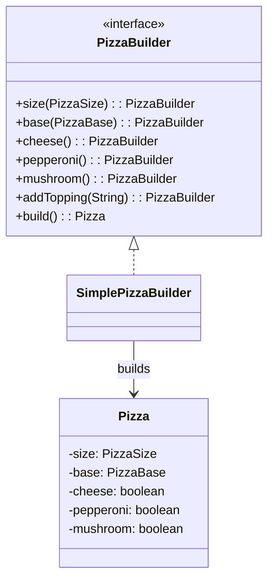

# Fluent Builder (Pizza)

Simple fluent builder demonstrating method chaining without a factory.

## UML


## Entities
- `Pizza`: Immutable product with size, base, and toppings
- `PizzaBuilder` (interface): Fluent contract
- `SimplePizzaBuilder`: Concrete fluent builder

## Run
```bash
javac -d . designPatterns/creational/builder/fluent/*.java
java -cp . designPatterns.creational.builder.fluent.Main
```


