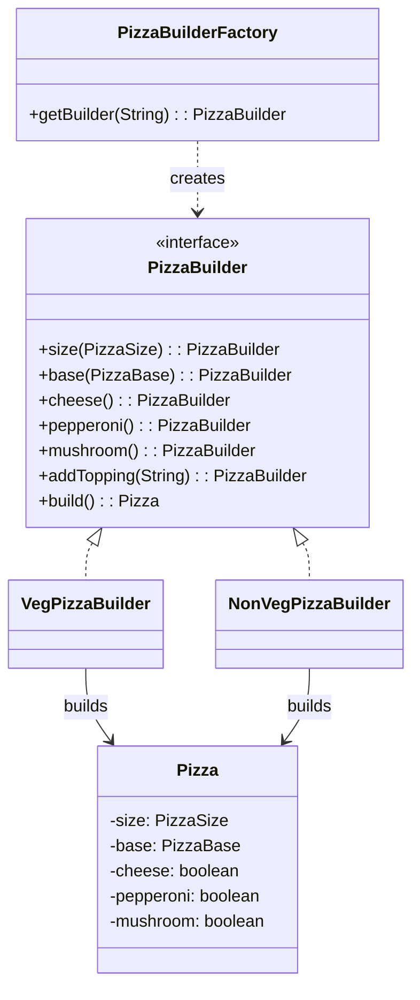

# Fluent Builder + Factory (Pizza)

Fluent builders (`VegPizzaBuilder`, `NonVegPizzaBuilder`) are selected using `PizzaBuilderFactory`.

## UML


## Entities
- `Pizza`: Immutable product
- `PizzaBuilder` (interface): Fluent contract
- `VegPizzaBuilder`: Veg constraints
- `NonVegPizzaBuilder`: Non-veg options
- `PizzaBuilderFactory`: Selects builder type

## Run
```bash
javac -d . designPatterns/creational/builder/fluentFactory/*.java
java -cp . designPatterns.creational.builder.fluentFactory.Main
```


