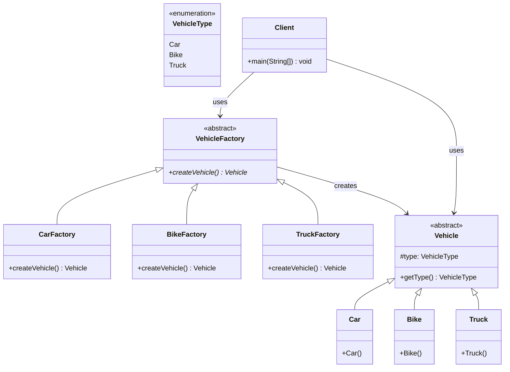

# Factory Method Pattern

## Overview
The Factory Method pattern defines an interface for creating objects, but lets subclasses decide which class to instantiate. It encapsulates object creation and allows subclasses to provide their own implementations of the creation process.

## Problem
- Need to create objects without specifying their exact classes
- Object creation logic varies by subclass
- Want to delegate object creation to subclasses
- Need flexibility in object creation process

## Solution
- Abstract factory method in base class
- Concrete implementations in subclasses
- Each subclass creates its own type of object
- Client code works with abstract types

## UML Diagram



## Code Structure

### Files
- `Main.java` - Contains all classes and demonstration
- `VehicleType.java` - Enumeration of vehicle types

### Key Components

#### Abstract Vehicle Class
```java
abstract class Vehicle {
    protected VehicleType type;

    public VehicleType getType() {
        return type;
    }
}
```

#### Abstract Factory
```java
abstract class VehicleFactory {
    abstract Vehicle createVehicle();
}
```

#### Concrete Factories
```java
class CarFactory extends VehicleFactory {
    @Override
    public Vehicle createVehicle() {
        return new Car();
    }
}
```

## Usage Example

```bash
# Compile and run
javac -d . designPatterns/creational/factory/*.java
java -cp . designPatterns.creational.factory.Main
```

**Expected Output:**
```
Created vehicle: Car
Created vehicle: Bike
Created vehicle: Truck
```

## Benefits
- **Flexibility**: Easy to add new product types
- **Loose Coupling**: Client code depends on abstractions
- **Single Responsibility**: Each factory handles one product type
- **Open/Closed Principle**: Open for extension, closed for modification
- **Polymorphism**: Runtime determination of object types

## Use Cases
- GUI framework component creation
- Database connection factories
- Plugin system architectures
- Game object creation
- Document processing systems

## Variations
- **Parameterized Factory**: Factory methods with parameters
- **Factory with Registry**: Dynamic factory registration
- **Generic Factory**: Type-safe factory implementations
- **Factory with Caching**: Reuse existing instances

## Anti-Patterns to Avoid
- **God Factory**: Don't put all creation logic in one factory
- **Concrete Dependencies**: Avoid depending on concrete classes
- **Missing Abstraction**: Always use abstract base classes
- **Tight Coupling**: Don't make factories depend on concrete products

## Related Patterns
- **Simple Factory**: Centralized object creation
- **Abstract Factory**: Create families of related objects
- **Builder**: For complex object construction
- **Prototype**: Clone existing objects

## When to Use
- Object creation logic varies by subclass
- Need to delegate creation to subclasses
- Want to decouple client from concrete classes
- Planning to add new product types

## When NOT to Use
- Simple object creation with no variation
- Only one type of object to create
- Object creation is straightforward
- Performance is critical (factory adds overhead)

## Comparison with Simple Factory
- **Simple Factory**: One factory class, switch statement
- **Factory Method**: Multiple factory classes, polymorphism
- **Simple Factory**: Easier to implement
- **Factory Method**: More flexible and extensible
