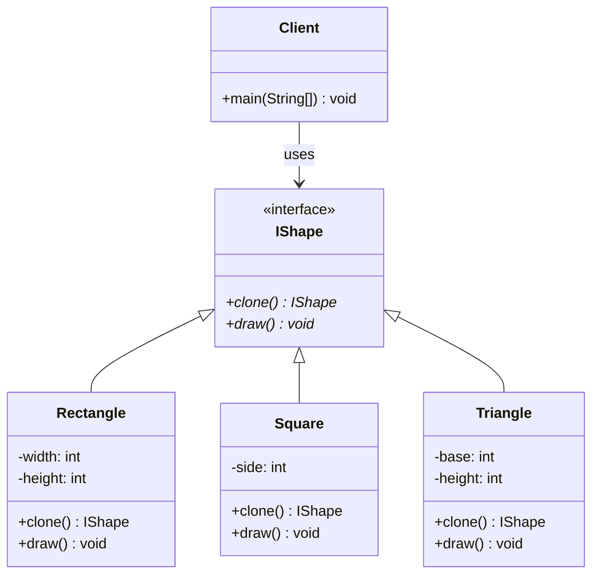

# Prototype Pattern

## Overview
The Prototype pattern creates objects by cloning existing instances rather than creating new ones from scratch. This is useful when object creation is expensive or when you need to create objects that are similar to existing ones.

## Problem
- Object creation is expensive (database queries, network calls)
- Need to create objects similar to existing ones
- Want to avoid subclassing for object creation
- Need to create objects at runtime

## Solution
- Clone existing objects instead of creating new ones
- Implement cloneable interface
- Shallow vs deep copying considerations
- Registry of prototype instances

## UML Diagram



## Code Structure

### Files
- `IShape.java` - Interface for cloneable shapes
- `Rectangle.java` - Concrete rectangle implementation
- `Square.java` - Concrete square implementation
- `Triangle.java` - Concrete triangle implementation
- `Main.java` - Demonstration of prototype pattern

### Key Components

#### IShape Interface
```java
public interface IShape {
    IShape clone();
    void draw();
}
```

#### Rectangle Implementation
```java
public class Rectangle implements IShape {
    private int width;
    private int height;

    public Rectangle(int width, int height) {
        this.width = width;
        this.height = height;
    }

    @Override
    public IShape clone() {
        return new Rectangle(this.width, this.height);
    }

    @Override
    public void draw() {
        System.out.println("Drawing Rectangle: " + width + "x" + height);
    }
}
```

## Usage Example

```bash
# Compile and run
javac -d . designPatterns/creational/prototype/*.java
java -cp . designPatterns.creational.prototype.Main
```

**Expected Output:**
```
Original Rectangle: 10x5
Cloned Rectangle: 10x5
Original Square: 7x7
Cloned Square: 7x7
Original Triangle: 8x6
Cloned Triangle: 8x6
```

## Benefits
- **Performance**: Avoid expensive object creation
- **Flexibility**: Create objects at runtime
- **Reduced Subclassing**: No need for factory hierarchies
- **Dynamic Configuration**: Objects can be configured before cloning
- **Memory Efficiency**: Reuse existing objects

## Use Cases
- Database connection pooling
- Game object creation
- Document templates
- Configuration objects
- GUI component creation

## Variations
- **Shallow Copy**: Copy object references
- **Deep Copy**: Copy all nested objects
- **Registry Pattern**: Store prototype instances
- **Factory with Prototypes**: Combine with factory pattern

## Anti-Patterns to Avoid
- **Shallow Copy Issues**: Be careful with mutable objects
- **Circular References**: Handle circular dependencies
- **Memory Leaks**: Don't hold references to cloned objects
- **Over-Engineering**: Don't use for simple objects

## Related Patterns
- **Factory Method**: Alternative for object creation
- **Abstract Factory**: Create families of related objects
- **Builder**: For complex object construction
- **Singleton**: Can be used as prototype

## When to Use
- Object creation is expensive
- Need to create similar objects
- Want to avoid subclassing
- Objects have complex initialization
- Need to create objects at runtime

## When NOT to Use
- Simple object creation
- Objects are always different
- Performance is not critical
- Objects have circular references

## Implementation Considerations

### Shallow vs Deep Copy
- **Shallow Copy**: Copies object references
- **Deep Copy**: Copies all nested objects
- **Java Cloneable**: Default implementation is shallow copy
- **Custom Implementation**: Implement deep copy when needed

### Best Practices
- Implement `Cloneable` interface
- Override `clone()` method
- Handle exceptions properly
- Consider deep vs shallow copying
- Use factory methods for complex cloning
