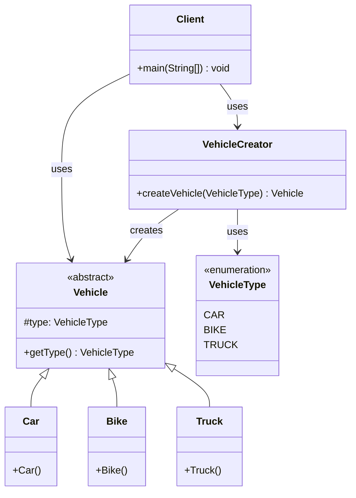

# Simple Factory Pattern

## Overview
The Simple Factory pattern creates objects without exposing the instantiation logic to the client. It encapsulates object creation in a single method, making the code more maintainable and following the Single Responsibility Principle.

## Problem
- Object creation logic scattered throughout the code
- Tight coupling between client and concrete classes
- Difficult to modify or extend object creation
- Violation of Open/Closed Principle

## Solution
- Centralize object creation in a factory class
- Hide creation complexity from clients
- Single point of change for object creation
- Easy to extend with new types

## UML Diagram



## Code Structure

### Files
- `Vehicle.java` - Abstract base class for vehicles
- `Car.java` - Concrete car implementation
- `Bike.java` - Concrete bike implementation
- `Truck.java` - Concrete truck implementation
- `VehicleCreator.java` - Factory class for creating vehicles
- `VehicleType.java` - Enumeration of vehicle types
- `Main.java` - Demonstration of simple factory

### Key Components

#### Vehicle.java
```java
public abstract class Vehicle {
    protected VehicleType type;

    public VehicleType getType() {
        return this.type;
    }
}
```

#### VehicleCreator.java
```java
public class VehicleCreator {
    public Vehicle createVehicle(VehicleType type) {
        if (type.equals(VehicleType.CAR))
            return new Car();
        else if (type.equals(VehicleType.BIKE))
            return new Bike();
        else
            return new Truck();
    }
}
```

## Usage Example

```bash
# Compile and run
javac -d . designPatterns/creational/simpleFactory/*.java
java -cp . designPatterns.creational.simpleFactory.Main
```

**Expected Output:**
```
Created vehicle: CAR
Created vehicle: BIKE
```

## Benefits
- **Centralized Creation**: All object creation in one place
- **Loose Coupling**: Client doesn't depend on concrete classes
- **Easy Extension**: Add new types without changing client code
- **Single Responsibility**: Factory only handles object creation
- **Consistent Interface**: Same creation method for all types

## Use Cases
- Database connection creation
- Logger instantiation
- UI component creation
- Plugin system initialization
- Configuration object creation

## Variations
- **Parameterized Factory**: Different parameters for different objects
- **Static Factory**: Static methods for object creation
- **Factory with Registry**: Dynamic registration of creators
- **Factory with Caching**: Reuse existing instances

## Anti-Patterns to Avoid
- **God Factory**: Don't put all creation logic in one factory
- **Switch Statements**: Use polymorphism instead of large switch statements
- **Tight Coupling**: Don't make factory depend on concrete classes
- **Missing Abstraction**: Always use abstract base classes

## Related Patterns
- **Factory Method**: Delegate creation to subclasses
- **Abstract Factory**: Create families of related objects
- **Builder**: For complex object construction
- **Prototype**: Clone existing objects

## When to Use
- Object creation logic is complex
- Need to centralize object creation
- Want to decouple client from concrete classes
- Planning to add new types frequently

## When NOT to Use
- Simple object creation with no logic
- Only one type of object to create
- Object creation is straightforward
- Performance is critical (factory adds overhead)
