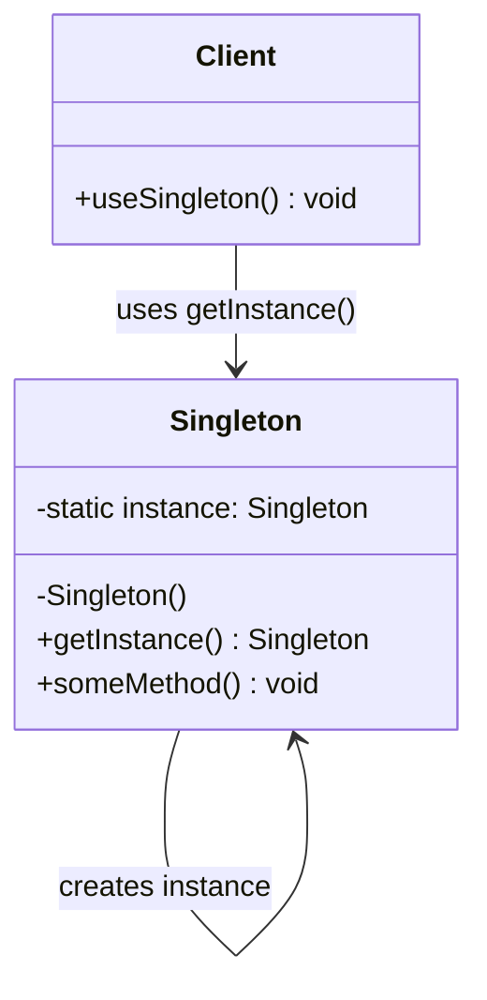

# Singleton Pattern

## Overview
The Singleton pattern ensures that a class has only one instance and provides a global access point to that instance. This is useful when you need exactly one object to coordinate actions across the system.

## Problem
- Need to ensure only one instance of a class exists
- Global access point required
- Control over instantiation process
- Resource sharing across application

## Solution
- Private constructor prevents external instantiation
- Static method provides controlled access
- Lazy initialization for performance
- Thread-safe implementation

## UML Diagram



## Code Structure

### Files
- `Printer.java` - Singleton class with thread-safe implementation
- `PrinterService.java` - Service class using the singleton
- `Main.java` - Demonstration of singleton usage

### Key Components

#### Printer.java
```java
public class Printer {
    private static volatile Printer instance;
    private int pageCount = 0;

    private Printer() {} // Private constructor

    public static Printer getInstance() {
        if (instance == null) {
            synchronized (Printer.class) {
                if (instance == null) {
                    instance = new Printer();
                }
            }
        }
        return instance;
    }
}
```

#### PrinterService.java
```java
public class PrinterService {
    private Printer printer;

    public PrinterService() {
        this.printer = Printer.getInstance();
    }
}
```

## Usage Example

```bash
# Compile and run
javac -d . designPatterns/creational/singleton/*.java
java -cp . designPatterns.creational.singleton.Main
```

**Expected Output:**
```
Printing: Hello
Printing: World
Final page count: 2
```

## Benefits
- **Single Instance**: Guarantees only one instance exists
- **Global Access**: Easy access from anywhere in the application
- **Resource Control**: Manages shared resources efficiently
- **Lazy Loading**: Instance created only when needed

## Use Cases
- Database connections
- Logger instances
- Configuration managers
- Cache managers
- Thread pools

## Variations
- **Eager Initialization**: Instance created at class loading
- **Lazy Initialization**: Instance created on first access
- **Thread-Safe**: Synchronized access for multi-threaded environments
- **Double-Checked Locking**: Optimized thread-safe implementation

## Anti-Patterns to Avoid
- **Global State**: Can make testing difficult
- **Hidden Dependencies**: Makes code harder to understand
- **Thread Safety**: Ensure proper synchronization
- **Memory Leaks**: Be careful with static references

## Related Patterns
- **Factory Method**: Can be used to create singletons
- **Abstract Factory**: May return singleton instances
- **Prototype**: Alternative for object creation control
