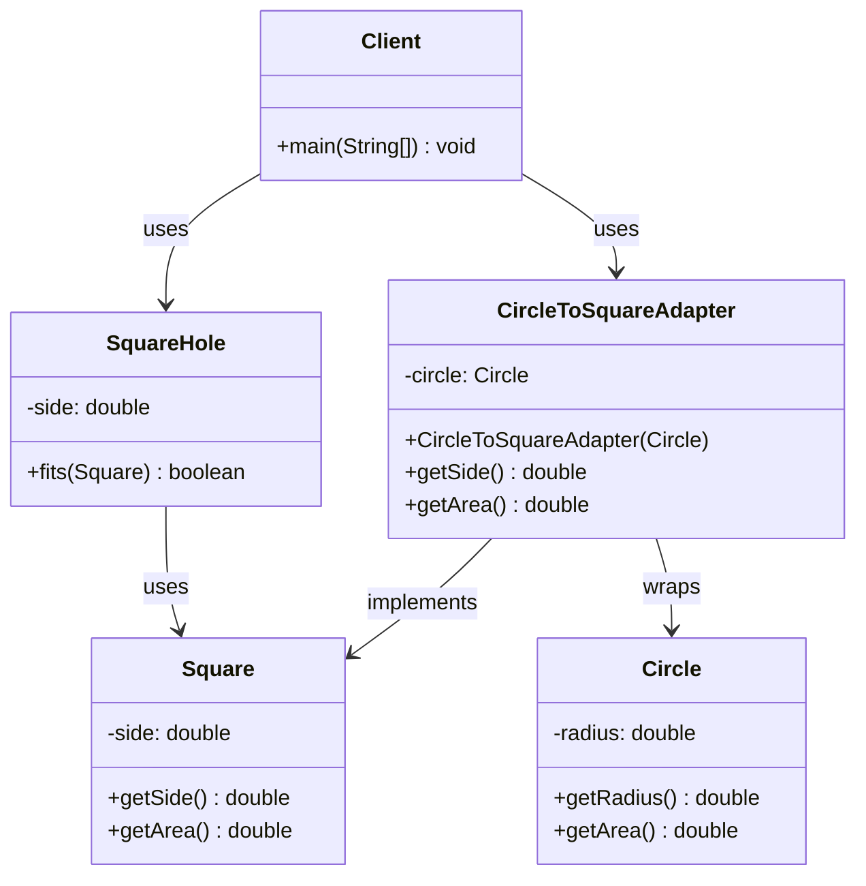

# Adapter Pattern

## Overview
The Adapter pattern allows incompatible interfaces to work together. It acts as a bridge between two incompatible interfaces by wrapping an existing class with a new interface, making it compatible with the client code.

## Problem
- Existing class has incompatible interface
- Need to use third-party libraries with different interfaces
- Want to reuse existing code without modification
- Interface mismatch between components

## Solution
- Create adapter class that implements target interface
- Wrap existing class with adapter
- Translate calls between interfaces
- Maintain existing functionality

## UML Diagram



## Code Structure

### Files
- `Square.java` - Target interface for square objects
- `Circle.java` - Existing class with incompatible interface
- `SquareHole.java` - Client class that works with squares
- `CircleToSquareAdapter.java` - Adapter that makes circle compatible with square
- `Main.java` - Demonstration of adapter pattern

### Key Components

#### Square Interface
```java
public class Square {
    private double side;

    public Square(double side) {
        this.side = side;
    }

    public double getSide() {
        return side;
    }

    public double getArea() {
        return side * side;
    }
}
```

#### Circle Class
```java
public class Circle {
    private double radius;

    public Circle(double radius) {
        this.radius = radius;
    }

    public double getRadius() {
        return radius;
    }

    public double getArea() {
        return Math.PI * radius * radius;
    }
}
```

#### Adapter Implementation
```java
public class CircleToSquareAdapter extends Square {
    private Circle circle;

    public CircleToSquareAdapter(Circle circle) {
        super(circle.getRadius() * 2); // Convert radius to side
        this.circle = circle;
    }

    @Override
    public double getArea() {
        return circle.getArea();
    }
}
```

## Usage Example

```bash
# Compile and run
javac -d . designPatterns/structural/adapter/*.java
java -cp . designPatterns.structural.adapter.Main
```

**Expected Output:**
```
Square fits in hole: true
Circle fits in hole: true (via adapter)
```

## Benefits
- **Interface Compatibility**: Makes incompatible interfaces work together
- **Reusability**: Reuse existing code without modification
- **Flexibility**: Easy to add new adapters
- **Single Responsibility**: Adapter handles interface translation
- **Open/Closed Principle**: Open for extension, closed for modification

## Use Cases
- Legacy system integration
- Third-party library integration
- Database adapter layers
- API compatibility layers
- GUI framework integration

## Variations
- **Object Adapter**: Uses composition to wrap existing class
- **Class Adapter**: Uses inheritance to extend existing class
- **Two-Way Adapter**: Provides bidirectional conversion
- **Pluggable Adapter**: Configurable adapter behavior

## Anti-Patterns to Avoid
- **Over-Engineering**: Don't use for simple interface mismatches
- **Performance Issues**: Adapters add overhead
- **Complex Inheritance**: Avoid deep adapter hierarchies
- **Tight Coupling**: Don't make adapters depend on concrete classes

## Related Patterns
- **Decorator**: Adds behavior to objects
- **Facade**: Provides simplified interface
- **Proxy**: Controls access to objects
- **Bridge**: Separates abstraction from implementation

## When to Use
- Need to use existing class with incompatible interface
- Want to reuse existing code without modification
- Need to integrate third-party libraries
- Interface mismatch between components

## When NOT to Use
- Simple interface changes
- Performance is critical
- Objects are always compatible
- Over-engineering simple problems

## Implementation Considerations

### Object vs Class Adapter
- **Object Adapter**: Uses composition, more flexible
- **Class Adapter**: Uses inheritance, simpler but less flexible
- **Java Limitation**: Java doesn't support multiple inheritance
- **Recommendation**: Use object adapter in Java

### Best Practices
- Keep adapters simple and focused
- Use composition over inheritance
- Handle exceptions properly
- Consider performance implications
- Document adapter behavior clearly
