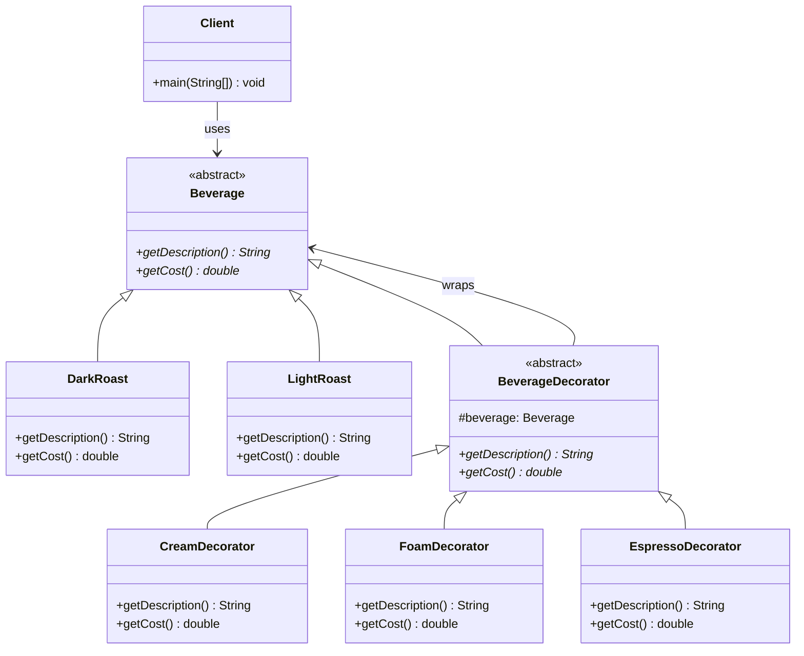

# Decorator Pattern

## Overview
The Decorator pattern allows you to add new behavior to objects dynamically without altering their structure. It provides a flexible alternative to subclassing for extending functionality, following the Open/Closed Principle.

## Problem
- Need to add behavior to objects at runtime
- Subclassing is not flexible enough
- Want to combine multiple behaviors
- Need to add/remove features dynamically

## Solution
- Wrap objects with decorators
- Each decorator adds specific behavior
- Chain decorators for multiple behaviors
- Maintain original object interface

## UML Diagram



## Code Structure

### Files
- `Beverage.java` - Abstract base class for beverages
- `DarkRoast.java` - Concrete dark roast coffee
- `LightRoast.java` - Concrete light roast coffee
- `BeverageDecorator.java` - Abstract decorator class
- `CreamDecorator.java` - Adds cream to beverages
- `FoamDecorator.java` - Adds foam to beverages
- `EspressoDecorator.java` - Adds espresso to beverages
- `Main.java` - Demonstration of decorator pattern

### Key Components

#### Beverage Abstract Class
```java
public abstract class Beverage {
    protected String description = "Unknown Beverage";

    public String getDescription() {
        return description;
    }

    public abstract double getCost();
}
```

#### BeverageDecorator Abstract Class
```java
public abstract class BeverageDecorator extends Beverage {
    protected Beverage beverage;

    public BeverageDecorator(Beverage beverage) {
        this.beverage = beverage;
    }

    @Override
    public abstract String getDescription();

    @Override
    public abstract double getCost();
}
```

#### Concrete Decorators
```java
public class CreamDecorator extends BeverageDecorator {
    public CreamDecorator(Beverage beverage) {
        super(beverage);
    }

    @Override
    public String getDescription() {
        return beverage.getDescription() + ", Cream";
    }

    @Override
    public double getCost() {
        return beverage.getCost() + 0.5;
    }
}
```

## Usage Example

```bash
# Compile and run
javac -d . designPatterns/structural/decorator/*.java
java -cp . designPatterns.structural.decorator.Main
```

**Expected Output:**
```
Beverage: Dark Roast, Cream, Foam
Cost: $2.5

Beverage: Light Roast, Espresso, Cream
Cost: $3.0
```

## Benefits
- **Dynamic Behavior**: Add/remove behavior at runtime
- **Flexibility**: Combine multiple decorators
- **Single Responsibility**: Each decorator has one responsibility
- **Open/Closed Principle**: Open for extension, closed for modification
- **Composition over Inheritance**: Prefer composition

## Use Cases
- GUI component decoration
- Stream processing
- Middleware in web frameworks
- Logging and monitoring
- Caching layers

## Variations
- **Transparent Decorator**: Maintains same interface
- **Opaque Decorator**: Changes interface
- **Chained Decorators**: Multiple decorators in sequence
- **Decorator Factory**: Creates decorated objects

## Anti-Patterns to Avoid
- **Over-Decoration**: Don't add too many decorators
- **Performance Issues**: Decorators add overhead
- **Complex Inheritance**: Avoid deep decorator chains
- **Tight Coupling**: Don't make decorators depend on concrete classes

## Related Patterns
- **Adapter**: Changes interface of objects
- **Facade**: Provides simplified interface
- **Proxy**: Controls access to objects
- **Chain of Responsibility**: Passes requests along chain

## When to Use
- Need to add behavior dynamically
- Want to combine multiple behaviors
- Subclassing is not flexible enough
- Need to add/remove features at runtime

## When NOT to Use
- Simple behavior addition
- Performance is critical
- Behavior is always the same
- Over-engineering simple problems

## Implementation Considerations

### Design Principles
- **Single Responsibility**: Each decorator has one job
- **Open/Closed**: Open for extension, closed for modification
- **Composition over Inheritance**: Prefer composition
- **Interface Segregation**: Keep interfaces focused

### Best Practices
- Keep decorators simple and focused
- Use abstract base classes
- Handle exceptions properly
- Consider performance implications
- Document decorator behavior clearly

### Common Pitfalls
- **Circular Dependencies**: Avoid decorators that depend on each other
- **Memory Leaks**: Be careful with references
- **Performance**: Decorators add overhead
- **Complexity**: Don't over-decorate simple objects
